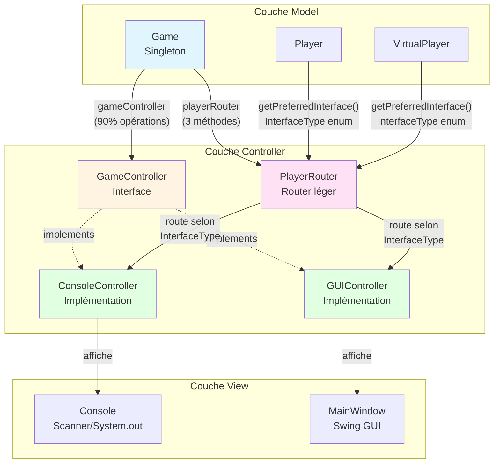
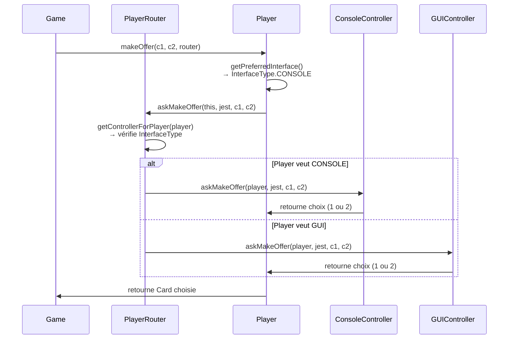
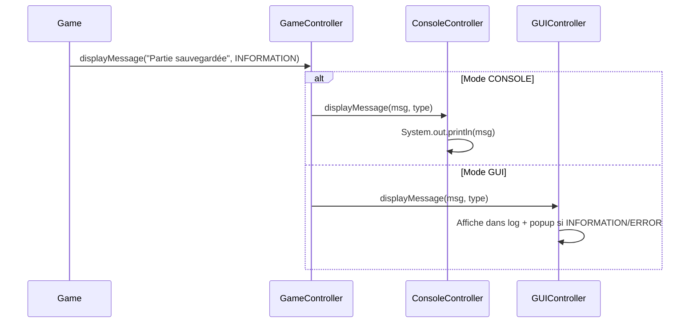
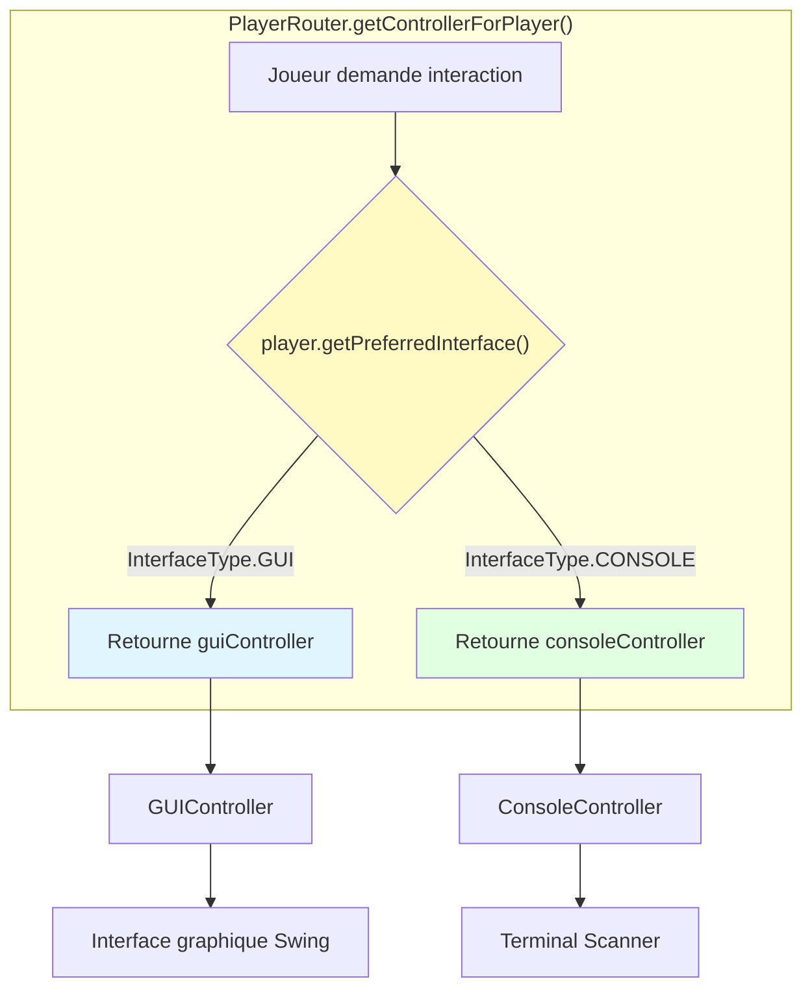

# Architecture des Controllers et Router

## Vue d'ensemble du système

## Flux d'exécution typique

### 1. Création d'une offre (makeOffer)

### 2. Message global (displayMessage)

## Routing selon le type d'interface joueur

